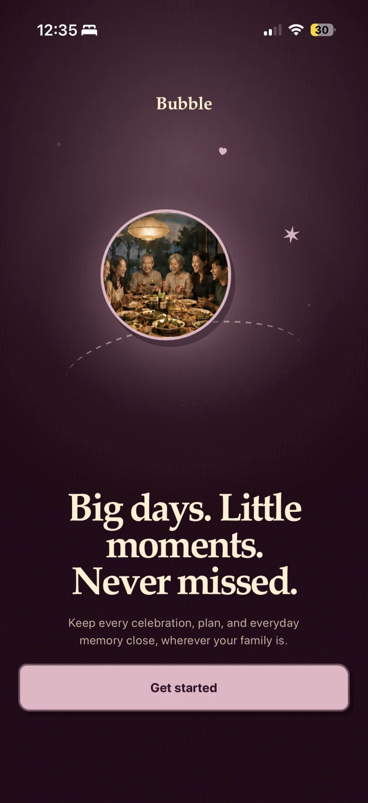
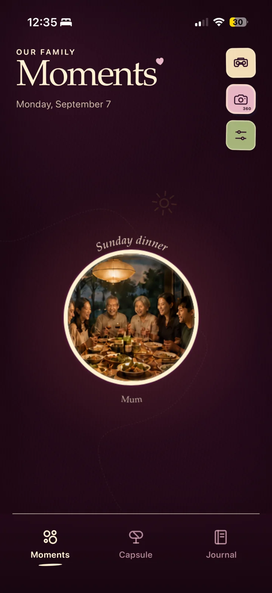
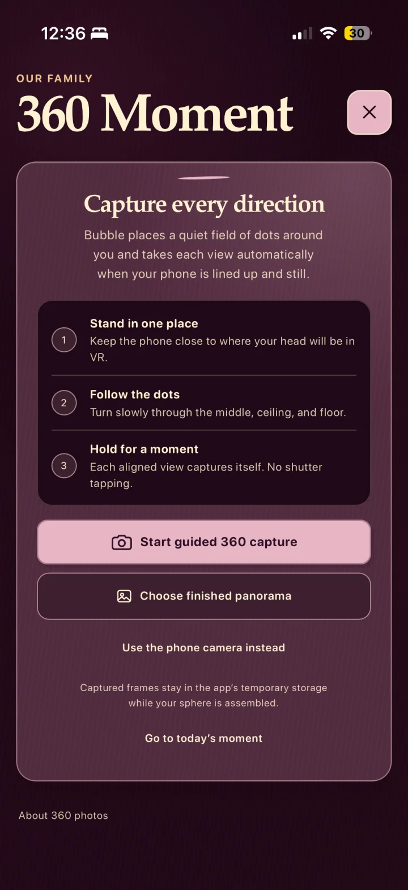
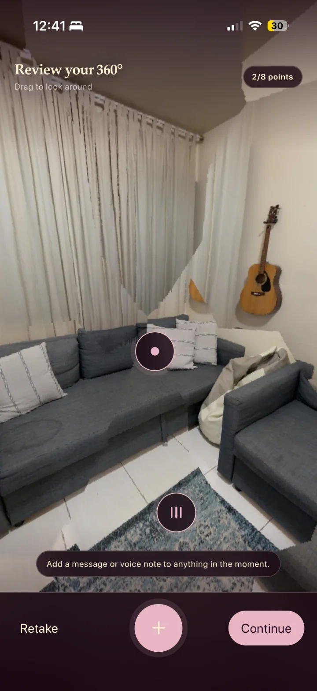
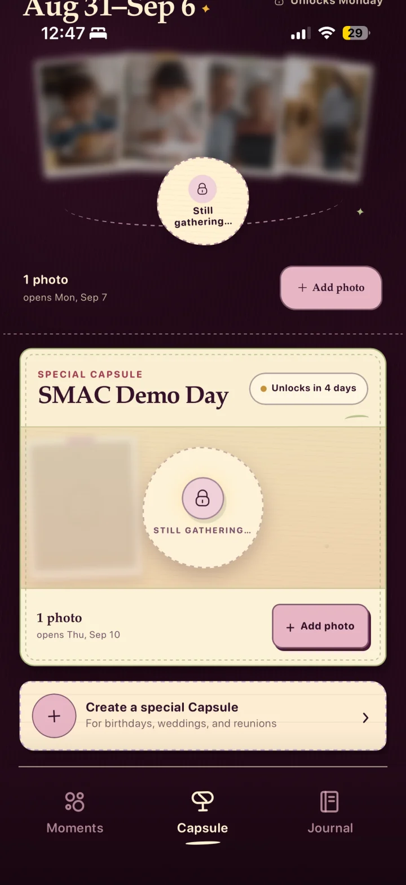
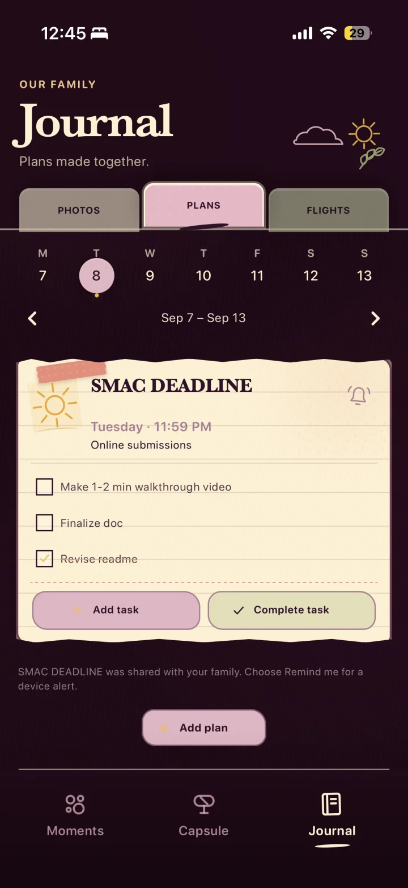
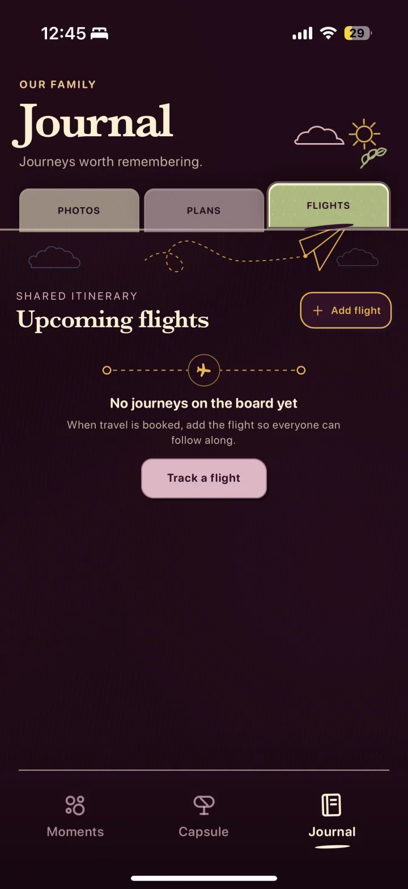
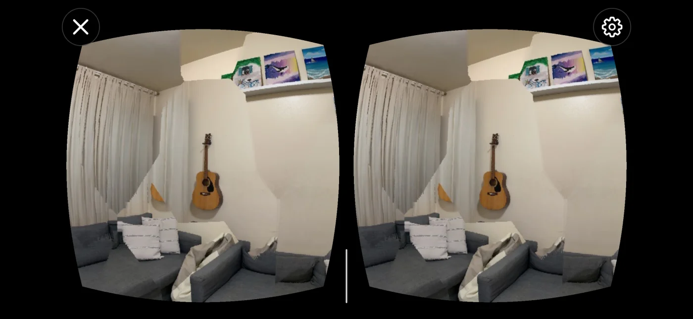
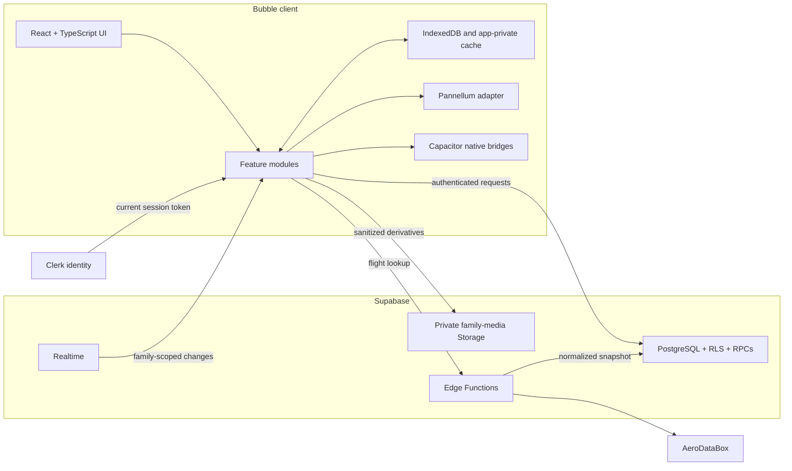

<p align="center">
  
</p>

<h1 align="center">Bubble</h1>

<p align="center">
  <strong>Big days. Little moments. Never missed.</strong>
</p>

<p align="center">
  A private, mobile-first space where families can capture immersive memories,
  seal weekly photo Capsules, keep a shared Journal, plan together, and follow
  the journeys that matter.
</p>

<p align="center">
  React & TypeScript &nbsp;·&nbsp; Capacitor &nbsp;·&nbsp; iOS & Android &nbsp;·&nbsp;
  Clerk &nbsp;·&nbsp; Supabase
</p>

<p align="center">
  
</p>

> [!NOTE]
> Bubble is an actively developed private prototype. The repository contains a 
> working web experience, native iOS and Android projects, custom capture and
> media plugins, a versioned Supabase backend, and automated tests. It is not an
> App Store or Play Store release, a hosted service, or a completed security
> audit.

## Contents

- [What Bubble is](#what-bubble-is)
- [Product tour](#product-tour)
- [Features and implementation](#features-and-implementation)
- [Architecture](#architecture)
- [Privacy and security](#privacy-and-security)
- [Technology stack](#technology-stack)
- [Repository map](#repository-map)
- [Getting started](#getting-started)
- [Configuration](#configuration)
- [Supabase backend](#supabase-backend)
- [Native development](#native-development)
- [Testing and quality gates](#testing-and-quality-gates)
- [Current limits and planned hardening](#current-limits-and-planned-hardening)
- [Documentation](#documentation)

## What Bubble is

Most family apps flatten memories into a feed. Bubble treats them as places,
collections, and shared rituals:

- **Moments** presents immersive family memories as a quiet constellation of
  bubbles instead of a public social timeline.
- **360° capture** guides a person around a room, assembles the overlapping
  views on-device, and lets the family explore the result by touch, motion, or
  a bounded Cardboard viewer.
- **Memory points** attach short text or voice notes to a location inside a
  panorama, so context stays connected to the object or place it describes.
- **Capsules** collect ordinary photos during a week or special occasion, keep
  other members' contributions sealed until a server-controlled opening time,
  and turn the opened set into a rapid video recap.
- **Journal** combines a private family photo archive, device-local face
  matching, person scrapbooks, shared plans, checklists, and flight tracking.
- **Family Circles** use real account and membership boundaries rather than
  relying on hidden UI. Approved membership is checked again by PostgreSQL Row
  Level Security and private Storage policies.

The interface is designed for phones first and ships in three complete visual
themes: **Plum**, **Forest**, and **Midnight**.

## Product tour

Only the screens needed to explain the core experience are shown here. Account
screens and personal face-library screenshots are intentionally omitted.

<table>
  <tr>
    <td width="50%" align="center">
      
      <br />
      <sub><strong>Moments</strong> — shared memories feel like places, not posts.</sub>
    </td>
    <td width="50%" align="center">
      
      <br />
      <sub><strong>Guided 360°</strong> — capture a room or import a finished panorama.</sub>
    </td>
  </tr>
  <tr>
    <td width="50%" align="center">
      
      <br />
      <sub><strong>Memory points</strong> — pin a message or voice note inside the scene.</sub>
    </td>
    <td width="50%" align="center">
      
      <br />
      <sub><strong>Capsules</strong> — gather now, open together later.</sub>
    </td>
  </tr>
  <tr>
    <td width="50%" align="center">
      
      <br />
      <sub><strong>Plans</strong> — family events, lightweight tasks, and reminders.</sub>
    </td>
    <td width="50%" align="center">
      
      <br />
      <sub><strong>Flights</strong> — follow upcoming journeys without storing ticket numbers.</sub>
    </td>
  </tr>
</table>

<p align="center">
  
  <br />
  <sub><strong>Cardboard mode</strong> — an optional split-screen view for an immersive phone headset.</sub>
</p>

The repository contains resized, metadata-free WebP copies of these selected
screenshots; the original phone captures are not committed.

## Features and implementation

### Moments and the family constellation

The home screen places memories on a large, pannable constellation rather than
inside a chronological feed. Bubble positions each item deterministically,
adds gentle motion when reduced-motion preferences allow it, and keeps the
primary actions close at hand: open Cardboard, capture a 360° Moment, or change
settings.

Implementation highlights:

- React routes and feature chunks are loaded lazily, so the initial shell does
  not pull every Journal, capture, and viewer dependency into the first screen.
- Local demo memories and family-synced Moments use the same bubble components.
- Account and family identifiers namespace cached state, object URLs, and
  subscriptions so switching identity cannot reuse another family's data.
- Supabase Realtime invalidates the current family's shared Moment list. A
  disconnected share can remain on this device, but 360° Moments do not yet
  have the automatic retry queue used by Capsule and Journal photos.
- Capture drafts and the no-credentials preview remain local and are never
  presented as cross-device family delivery.
- Opening a panorama uses the same normal viewer regardless of whether its
  source is a bundled demo, a local draft, or authorized private Storage.

### Guided 360° capture and import

Each family day can include one unpredictable 15-minute 360° window, selected
between 10:00 and 18:30 in the family owner's time zone. Each approved member
can contribute once during that scheduled window. Manual capture or import is
available at any time and does not consume the scheduled contribution.

Bubble supports two panorama paths:

1. **Installed-app guided capture.** A native full-screen guide places targets
   in horizontal rings plus the ceiling and floor. A view is taken
   automatically only when tracking is usable, the target is aligned, and the
   phone has been held steady.
2. **Finished-panorama import.** Web and native builds can accept a compatible
   JPEG captured elsewhere. The browser also provides an interactive preview
   of the guide, but it does not pretend to perform native pose-linked capture.

The installed capture plugins use **ARKit** on iOS and **ARCore** on Android.
They return pose-tagged temporary frames and camera data to a shared TypeScript
compositor. The compositor projects perspective frames onto a sphere,
normalizes exposure, feathers overlaps, verifies coverage, and produces an
exact 2:1 equirectangular derivative. Session frames live only in app-owned
temporary storage and are removed after cancellation, failure, or successful
composition.

Imported images are bounded before decoding and sharing:

- JPEG input
- maximum input size of 25 MB
- maximum decoded area of 80 million pixels
- panorama aspect-ratio validation
- output viewer image no larger than 4096 × 2048
- a separate thumbnail derivative

Canvas re-encoding creates new JPEGs without the selected file's original EXIF
or GPS metadata. The selected original panorama is not uploaded.

### Memory points, voice notes, and discussion

Before sharing, a member can look around the panorama and attach up to eight
position-bound annotations:

- **Message point:** up to 180 characters.
- **Voice point:** up to 60 seconds, with a required text description so the
  meaning remains accessible without audio.

Pitch and yaw keep each point attached to its location in the sphere. Voice is
recorded through the browser media APIs exposed by the WebView, then stored in
the same private family boundary as the Moment. The uploader can replace the
annotation set later; unchanged annotation IDs are preserved so existing
replies remain attached. Family comments can target either the entire Moment
or a specific memory point, are capped at 500 characters, and derive authorship
server-side. Recording stops at the 60-second limit and is shut down if the app
moves to the background; the text-point path remains available when recording
is unsupported.

### Panorama viewing and Cardboard

The standard viewer is powered by a pinned local build of **Pannellum 2.5.7**
behind an isolated adapter. It supports touch drag, zoom, optional device
orientation, resize, scene changes, teardown, and a flat fallback. No viewer
script is loaded from a runtime CDN.

Cardboard mode is intentionally bounded:

- iOS uses the vendored Google Cardboard framework with a Metal renderer.
- Android uses the local Cardboard dependency with OpenGL ES.
- Both present synchronized left and right eye views, follow device rotation,
  enter landscape/fullscreen where the platform allows it, and return to the
  same memory on exit.
- The same monoscopic equirectangular image is duplicated for both eyes;
  Cardboard currently exposes rotation/drag, not memory-point interaction.
- This is a phone-in-headset panorama viewer, not true stereo depth, WebXR,
  positional tracking, depth reconstruction, or standalone-headset VR.

The normal touch viewer and accessible controls remain the primary path.

### Weekly and special Capsules

Capsules deliberately use an ordinary-photo pipeline, not the 360° panorama
pipeline. Families get one Monday-to-Monday weekly collection and can create
named special Capsules for birthdays, weddings, reunions, or any future
occasion. A special Capsule opens at 8:00 PM on its chosen future day; the
backend rejects a date earlier than tomorrow or beyond its bounded planning
window.

Before opening:

- approved members can see safe Capsule metadata and the total contribution
  count;
- an uploader can still see their own contribution;
- other members cannot query or sign another person's photo objects; and
- changing the phone clock cannot open the Capsule early.

The database clock and Storage policies enforce the boundary. Selected photos
are freshly encoded as metadata-free full and thumbnail JPEGs, with a
2048-pixel maximum edge for the full derivative and 560 pixels for the
thumbnail. Pending contributions are stored in account/family-scoped IndexedDB
and reconciled when connectivity returns. The pre-open collage shown by the UI
is a synthetic teaser—it is not a blurred rendering of another member's locked
photo.

Opened Capsules can become a deterministic recap:

| Output | Implementation |
| --- | --- |
| Ordering | Capture time, capped at 150 photos |
| Timing | 30 fps, six frames per photo, exactly 0.2 seconds per photo |
| iOS | Native 1080 × 1920 H.264 MP4 via `AVAssetWriter` |
| Android | Native 1080 × 1920 H.264 MP4 via `MediaCodec` |
| Browser | Feature-detected Canvas and `MediaRecorder` fallback at 720 × 1280 |
| Delivery | Native share sheet or browser download when supported |

### Journal Photos, People, and scrapbooks

Journal Photos is an immediate private archive. Unlike a Capsule contribution,
a Journal photo does not wait for a reveal date. It is processed into a fresh
full-size derivative and thumbnail, saved to an account/family-scoped local
store, and retried to private Storage in the background when family sync is
available.

People albums use **Human** with local BlazeFace, FaceMesh, and FaceRes model
assets. The matcher prefers WebGL and falls back to CPU. A member enrolls a
person with one to five clear reference portraits, reviews ambiguous results,
and can correct or clear matches. The local library supports up to 100 people
and up to 12 retained reference views per person; scanning can be cancelled and
resumed, and manual tagging remains available when automatic matching is not a
good fit.

The privacy boundary is intentionally split:

- sanitized Journal photos may sync to the approved family;
- reference portraits are scanned once and are not retained;
- face boxes, embeddings, detections, match results, and numeric biometric
  descriptors are not uploaded to Supabase or Storage;
- embeddings remain in IndexedDB, while the smaller `localStorage` fallback
  deliberately excludes vectors; and
- person scrapbook details such as relation, favorite things, and notes remain
  device-local.

Ambiguous matches can be marked **Yes**, **No**, or **Not sure**. Clearing face
analysis removes local descriptors and automatic results while preserving the
person names, manual tags, and user-corrected dates that do not require a face
embedding.

Revealed Capsule photos can also appear in the Journal archive, while locked
Capsule images never enter the People scanner or the DOM.

### Shared plans and reminders

Plans live inside Journal rather than a separate Events tab. The add flow
collects a title, date, time, optional location, and up to 12 checklist tasks;
the visual accent is generated by the app. Family changes are synchronized
through Supabase Realtime with a local prototype fallback. Checklist ticks are
device-local presentation state, while the plan and task definitions form the
shared record. The card's **Complete task** action completes the whole plan.

Reminder behavior is explicit:

- the installed app schedules an opt-in local notification approximately one
  hour before the event;
- identifiers are deterministic and account-scoped so one account cannot
  cancel another account's reminders;
- lock-screen copy is generic and omits the event title or family text;
- the app reconciles desired reminders with OS-scheduled reminders on launch
  and foreground; and
- browser reminders are best-effort and work only while the tab stays open.

### Family flight tracking

Flights are shared Journal items. Bubble accepts an airline flight number, the
origin airport's local departure date, and an optional card header—never a
ticket number. Ticket-like 13-digit input is rejected before local or server
persistence.

The client calls the `flight-status` Supabase Edge Function, which:

1. authenticates the current Clerk session through Supabase;
2. confirms approved Family Circle membership before spending provider quota;
3. validates and normalizes the flight identity;
4. calls the fixed AeroDataBox HTTPS host through RapidAPI;
5. handles airline-code aliases, codeshares, and ambiguous same-day results;
6. rechecks authorization and stored identity before a service-role write; and
7. stores only a normalized status snapshot.

The backend allows 12 lookups per approved member and 30 per family per five
minutes. A bounded 60-second response cache and 24-hour airport cache reduce
duplicate provider requests. Each phone also limits automatic refreshes, while
an explicit refresh remains available.

Optional departure and arrival alerts are local notifications. They are not
airline push alerts: Bubble cannot discover a new delay while the app is killed
unless the app is reopened and refreshes the saved flight. Cached cards remain
readable offline, but a new lookup or refresh requires the network. Live ADS-B,
estimated, scheduled, stale, and cancelled states are labeled separately;
cancelled flights suppress aircraft progress and an arrival estimate.

### Authentication, families, themes, and settings

- **Authentication:** Clerk owns Google and email-code sign-in, session
  persistence, and sign-out. Supabase receives the current Clerk token through
  its native third-party authentication integration; the client does not mint a
  legacy Supabase JWT template.
- **Family setup:** a server-generated, persistent `BUB-...` share code creates
  or immediately joins one durable Family Circle and can be rotated by its
  owner. The legacy `ks1_...` invite flow uses pending owner approval. The MVP
  enforces one approved family per user.
- **Authorization:** signed-in routes pass through an authentication gate and an
  approved-membership gate before family-scoped providers mount.
- **Settings:** profile, family membership, preferences, and theme controls live
  on one dedicated screen.
- **Themes:** Plum, Forest, and Midnight share semantic tokens for surfaces,
  fields, focus states, navigation, and accents instead of duplicating screen
  logic. The selected theme is local to the browser/device, not family-synced.

### Where data lives

Bubble names local and shared state explicitly instead of using “offline-first”
as a blanket promise.

| Data | Device | Family backend | Offline behavior |
| --- | --- | --- | --- |
| 360° source frames/original | temporary or selected local input | never uploaded | removed after composition/cancellation; original stays local |
| Shared 360° derivative | local preview/cache | private Storage + Moment row when connected | a disconnected share stays local and is not yet auto-uploaded |
| Capsule and Journal derivatives | account/family-scoped IndexedDB | queued/retried to private Storage | resumes after reopen, foreground, or reconnect; no transfer continues after OS termination |
| Face descriptors and match state | IndexedDB only | never uploaded | local scans and corrections remain available on that device |
| Person scrapbook details | device only | not synced | stays with that local account/family namespace |
| Plan record and task definitions | local fallback/cache | family row | shared when connected |
| Checklist ticks and reminder | device | reminder preference may be stored | already scheduled native alerts can fire offline |
| Flight snapshot | device cache | shared normalized row | cached card opens offline; lookup/refresh requires network |
| Flight alert | device notification | no remote airline alert | cannot learn a new delay while the app is killed |
| Theme | `localStorage` | not synced | persists on that browser/device |

## Architecture

Bubble is one React codebase with explicit browser, native, and backend
boundaries.



### Responsibility boundaries

| Boundary | Owns | Does not own |
| --- | --- | --- |
| React client | routing, interaction, validation, local media processing, offline state, viewer orchestration | service-role operations, provider secrets, membership authority |
| Native plugins | AR-guided capture, app-private temporary files, Cardboard rendering, native recap encoding, native auth storage | product authorization or family policy |
| Clerk | user identity, sign-in methods, sessions, token refresh | family membership and media authorization |
| Supabase | internal identity mapping, memberships, data, server time, RLS, private Storage, Realtime, guarded RPCs | local face embeddings and original source media |
| Edge Function | authenticated provider lookup, response normalization, rate limiting, privileged flight persistence | client rendering or unrestricted provider access |
| Pannellum adapter | panorama rendering, touch, motion, zoom, scene lifecycle | authentication, uploads, family rules, or database access |

### Principal data flows

#### Sign-in and family bootstrap

1. Clerk restores or creates the user session.
2. The Supabase client requests the current Clerk token for each authenticated
   data, Storage, or Realtime operation.
3. `bootstrap_current_user` maps the trusted Clerk `sub` to a stable internal
   UUID and creates the app profile when needed.
4. The family RPC resolves the user's approved circle from that internal ID.
5. Only then does Bubble mount family-scoped caches and subscriptions.

#### Share a 360° Moment

1. Native capture returns pose-tagged temporary frames, or the user selects a
   finished panorama.
2. The client validates, composes when necessary, and creates new metadata-free
   viewer and thumbnail JPEGs.
3. The client uploads immutable objects beneath the current circle and uploader
   path—never with overwrite/upsert.
4. A guarded RPC rechecks membership, canonical paths, reported geometry, and
   any daily server-time window before marking the Moment ready.
5. Approved family clients receive a Realtime change and load protected media
   through short-lived authenticated access.

#### Delete a shared Moment

Deletion is intentionally two-phase. The first RPC changes the row to a
family-visible tombstone so every client revokes cached access. The uploader
then removes the exact returned Storage objects and finishes metadata cleanup.
Interrupted cleanup can be listed and resumed; an owner may finish a tombstoned
cleanup after the original uploader leaves, but cannot initiate deletion of
another member's ready Moment.

#### Open a Capsule

The database creates the weekly or special Capsule and owns `opens_at`. Before
that instant, RLS exposes only each uploader's own items. After it, approved
members can fetch the ordered set and render the same deterministic recap plan.
The device clock is presentation input, never reveal authority.

### Route map

| Route | Screen |
| --- | --- |
| `/login` | Clerk sign-in and development/demo access |
| `/onboarding` | Create or join a family |
| `/` | Moments constellation |
| `/memory/:memoryId` | Panorama viewer and comments |
| `/capture` | Daily or manual 360° capture/import flow |
| `/capsule/*` | Weekly and special Capsules |
| `/journal` | Photos, People, Plans, and Flights |
| `/journal/person/:personId` | Device-local person scrapbook |
| `/journal/photo/:capsuleId/:photoId` | Revealed Capsule photo |
| `/journal/library/:photoId` | Journal photo viewer |
| `/settings` | Profile, family, appearance, and preferences |

Historical `/capsules/*`, `/events/*`, and `/profile/*` links are redirected to
their current destinations.

## Privacy and security

Privacy is a data-flow constraint in Bubble, not just a screen label.

### Authorization

- Every private Supabase table uses Row Level Security.
- The central permission is an approved `circle_members` row for the current
  internal app user.
- Pending, rejected, removed, expired, and unrelated users do not gain family
  content access.
- Sensitive writes use narrowly scoped RPCs with explicit authorization;
  showing or hiding a button is never treated as the permission boundary.
- Membership removal blocks new server access immediately. Cache and Storage
  cleanup may finish asynchronously, but authorization does not wait for it.

### Media handling

- Original selected panoramas stay local.
- Shared panoramas, Capsule photos, and Journal photos are freshly re-encoded
  before upload so app-owned derivatives do not carry source EXIF/GPS metadata.
- The `family-media` bucket is private; canonical object paths include circle,
  media class, internal uploader ID, and immutable file ID.
- Media downloads are authorized before they are given to the viewer.
- Face embeddings and match results remain local and are separated from the
  synced family-photo records.

Current finalizers verify canonical object rows, MIME metadata, reported sizes,
and geometry. They do **not** yet independently decode every uploaded JPEG on a
trusted server. That additional verification and abandoned-staging cleanup are
listed under [current limits](#current-limits-and-planned-hardening).

### Time and side effects

- Invite expiry, daily capture windows, Capsule opening, and backend
  reminder-job eligibility use database/server time.
- Invite codes are generated server-side; stored invite credentials are hashed.
- Persistent family share codes are generated from 96 random bits.
- Flight provider credentials, Supabase service-role credentials, cron tokens,
  and future push/AI credentials remain server-only.
- Reminder text is generic so lock screens do not reveal the plan title or
  family message.
- CORS uses an allowlist. The two native origins are
  `capacitor://localhost` on iOS and `https://localhost` on Android.

### Storage path contract

```text
<circle-uuid>/<media-class>/<internal-user-uuid>/<immutable-file>
```

Current media classes include:

```text
panoramas/
thumbnails/
voice/
capsule-images/
capsule-thumbnails/
journal-images/
journal-thumbnails/
```

Clients upload without overwrite. Finalization RPCs accept only the expected
uploader-scoped path and an existing private Storage object.

## Technology stack

| Layer | Technology | Role |
| --- | --- | --- |
| UI | React 19, React DOM 19 | Mobile-first component application |
| Routing | React Router 7 | Hash-based native/web routing and lazy route chunks |
| Language | TypeScript 6 | Shared browser and domain code |
| Build | Vite 8 | Development server and production bundles |
| Native shell | Capacitor 8 | iOS/Android packaging and bridge |
| Authentication | Clerk | Google/email-code sign-in and session lifecycle |
| Backend | Supabase JS, PostgreSQL 15 | RLS data model, guarded RPCs, Storage, Realtime |
| Server functions | Supabase Edge Functions / Deno | Flight-provider boundary |
| 360° viewer | Pannellum 2.5.7 | Bundled panorama rendering |
| Native capture | ARKit, ARCore | Pose-linked overlapping frame capture |
| Native VR | Google Cardboard, Metal, OpenGL ES | Bounded split-eye panorama mode |
| Video recap | AVFoundation, MediaCodec, MediaRecorder | Capsule MP4/browser recap generation |
| Local face matching | Human, BlazeFace, FaceMesh, FaceRes | Device-local detection and embeddings |
| Metadata | exifr | Capture-date extraction before re-encoding |
| Local persistence | IndexedDB, app-private temporary/cache files | Offline drafts, processed bytes, local face state |
| Notifications | Capacitor Local Notifications | Device-local plan and flight alerts |
| Tests | Vitest 4, Testing Library, jsdom, pgTAP, Deno tests | Client, database/RLS, and Edge coverage |
| Static analysis | oxlint, TypeScript | Lint and type gates |
| Package manager | pnpm 11.19 | Reproducible dependency installation |

## Repository map

```text
.
├── src/
│   ├── app/                     routes, providers, shell, account scoping
│   ├── features/
│   │   ├── auth/                Clerk and native authentication
│   │   ├── onboarding/          family creation and join flow
│   │   ├── memories/            constellation, panorama, comments, Cardboard
│   │   ├── capture/             guided capture, import, review, memory points
│   │   ├── capsules/            locked collections and recap renderers
│   │   ├── journal/             photo archive, People, scrapbooks
│   │   ├── events/              plans, tasks, reminders
│   │   ├── flights/             tracking, provider normalization, alerts
│   │   └── profile/             account, family sync, preferences
│   ├── services/                media processing, sync, persistence
│   ├── viewer/                  isolated Pannellum adapter
│   ├── lib/                     validated environment and Supabase client
│   └── theme/                   semantic theme tokens and provider
├── public/
│   ├── vendor/pannellum/        pinned offline viewer runtime
│   ├── models/human/            local face-model assets
│   └── assets/                  bundled demo media
├── ios/App/App/                 Swift, Metal, Objective-C++ native plugins
├── android/app/src/main/        Java, ARCore, OpenGL, MediaCodec plugins
├── supabase/
│   ├── migrations/              schema, RLS, RPCs, Storage policies
│   ├── functions/flight-status/ authenticated AeroDataBox proxy
│   ├── tests/                   pgTAP authorization/integration tests
│   └── seed.sql                 reproducible local seed
├── scripts/                     disposable backend test harness
├── docs/                        architecture, ADRs, roadmap, test runbooks
└── .github/workflows/           web and backend CI gates
```

## Getting started

### Prerequisites

| Goal | Requirements |
| --- | --- |
| Web/local prototype | Git, Node.js 22.12 or newer, Corepack, pnpm 11.19 |
| Real sign-in and family sync | Clerk application and Supabase project |
| Local backend/RLS tests | Docker Desktop and Deno 2.x |
| iOS | macOS, Xcode 26+, an Apple development team for devices |
| Android | Android Studio, Android SDK 36, JDK 17 |
| Capture/VR acceptance | Physical ARKit-capable iPhone, ARCore-capable Android device, Cardboard headset |

The repository pins Node `22.18.0` in [`.nvmrc`](./.nvmrc) and pnpm `11.19.0`
in [`package.json`](./package.json).

### Install and run the web app

```bash
corepack enable
pnpm install --frozen-lockfile
cp .env.example .env.local
pnpm dev
```

Open the local URL printed by Vite. During development, if Clerk is not
configured, Bubble exposes an explicit tab-scoped preview identity. That mode
is useful for UI and offline feature work; it is not cross-device family sync.

### Build and preview

```bash
pnpm build
pnpm preview
```

The production web output is written to `dist/`. This repository does not
currently include a Vercel, Netlify, or other hosted deployment target.

### Demo build

Create a gitignored `.env.demo`:

```dotenv
VITE_APP_ENV=demo
VITE_DEMO_LOGIN_ENABLED=true
```

Then run one of:

```bash
pnpm dev --mode demo
pnpm build:demo
pnpm cap:sync:demo
```

Demo access is intentionally a build-time prototype capability. Standard
production builds should keep `VITE_DEMO_LOGIN_ENABLED=false`.

## Configuration

Start from [`.env.example`](./.env.example). Only variables beginning with
`VITE_` may be read by browser code, and every such value is public because
Vite embeds it in the application bundle.

### Client-visible values

| Variable | Required | Purpose |
| --- | --- | --- |
| `VITE_APP_ENV` | No | Environment label; defaults to `development` |
| `VITE_CLERK_PUBLISHABLE_KEY` | For real auth | Clerk's client-safe publishable key |
| `VITE_SUPABASE_URL` | For sync | Supabase project URL |
| `VITE_SUPABASE_PUBLISHABLE_KEY` | For sync | Modern client-safe Supabase publishable key |
| `VITE_FLIGHT_TRACKER_ENDPOINT` | No | Optional compatible flight proxy hosted separately from the main Supabase project |
| `VITE_DEMO_LOGIN_ENABLED` | No | Enables prototype demo access in a demo build |

`VITE_SUPABASE_URL` and `VITE_SUPABASE_PUBLISHABLE_KEY` must be configured
together. Remote Supabase URLs must use HTTPS; plain HTTP is accepted only for
loopback development.

### Server-only values

These belong in the Supabase secret store or another server secret manager.
Never prefix them with `VITE_`.

| Variable | Purpose |
| --- | --- |
| `CLERK_SECRET_KEY` | Server-side Clerk administration when required |
| `SUPABASE_SERVICE_ROLE_KEY` | Privileged backend writes; never shipped to clients |
| `CRON_AUTH_TOKEN` | Authenticates trusted scheduled work |
| `AERODATABOX_RAPIDAPI_KEY` | Flight-provider credential |
| `APP_ALLOWED_ORIGINS` | Additional comma-separated hosted web origins for Edge Function CORS |

The template also reserves `AI_PROVIDER`, `AI_PROVIDER_API_KEY`, and
`AI_PROVIDER_MODEL` for a future text-only Family Thread workflow, plus FCM and
APNs variables for future generic remote push. Those integrations are not
implemented in the current product.

### Clerk and Supabase authentication setup

Outside the repository:

1. Configure Clerk for Google and email verification-code sign-in.
2. Require an email address and disable unsupported phone/password methods.
3. Register `com.simerfamily.kinsphere://callback` as a native redirect URL.
4. Allow `capacitor://localhost` and `https://localhost` as native origins.
5. Enable Clerk under Supabase Authentication → Third-party Auth using the
   exact Clerk domain.
6. Use Clerk's current session token through the Supabase JS `accessToken`
   callback. Do not create the deprecated Clerk Supabase JWT template.

See [ADR 0004](./docs/decisions/0004-clerk-supabase-third-party-auth.md) for the
identity mapping and trust boundary.

## Supabase backend

### Start a local stack

Docker Desktop must be running. The Supabase CLI is pinned as a development
dependency, so a global installation is not required.

```bash
pnpm supabase:start
pnpm supabase:reset
```

Stop it with:

```bash
pnpm supabase:stop
```

`supabase:reset` reapplies every migration and [`supabase/seed.sql`](./supabase/seed.sql).

### Serve the flight function locally

```bash
cp supabase/.env.demo.example supabase/.env.demo
```

Fill the gitignored file with a newly rotated provider key and allowed origins,
then run:

```bash
pnpm supabase:functions:serve:demo
```

### Deploy the flight function

```bash
pnpm exec supabase secrets set AERODATABOX_RAPIDAPI_KEY=your_server_only_key
pnpm exec supabase secrets set APP_ALLOWED_ORIGINS=https://your-app.example
pnpm exec supabase functions deploy flight-status --no-verify-jwt
```

Gateway JWT verification is disabled for this function because Clerk supplies
an asymmetric third-party session token. The function itself authenticates the
token through Supabase/PostgREST and verifies approved membership before any
provider call.

### Backend domains

The current migrations cover:

- Clerk-subject to internal-user identity mapping and profiles
- Family Circles, approved/removed membership, invites, join requests, and
  persistent family share codes
- daily/manual 360° Moments, annotations, comments, Realtime, and two-phase
  deletion
- weekly and special Capsules with server-authoritative reveal
- shared plans, checklist details, notification preferences, and scheduled jobs
- family flights, provider snapshots, ambiguity handling, and rate limits
- immediate Journal photos with bounded private Storage staging

Read [`supabase/README.md`](./supabase/README.md) for RPC contracts, path
formats, provider normalization, and maintenance rules.

## Native development

The Capacitor app is named **Bubble**. Its stable application identifier remains
`com.simerfamily.kinsphere` so existing keychain data, notification ownership,
and installed upgrades do not break during the product rename.

### Synchronize native projects

```bash
pnpm cap:sync
```

Or build, synchronize, and open a platform directly:

```bash
pnpm cap:ios
pnpm cap:android
```

### iOS

- minimum deployment target: iOS 15
- dependency management: Swift Package Manager
- guided capture: ARKit
- Cardboard panorama: vendored Google Cardboard XCFramework and Metal
- Capsule recap: AVFoundation / `AVAssetWriter`
- native authentication bridge: private client-token persistence and system web
  authentication callback
- a development team must be selected in Xcode before installing on a device

### Android

- minimum SDK: 24
- compile and target SDK: 36
- supported build JDK: 17
- guided capture: ARCore, optional at install time but required for that feature
- Cardboard panorama: local Cardboard dependency and OpenGL ES
- Capsule recap: `MediaCodec`, `MediaMuxer`, and OpenGL ES
- application backup is disabled; the debug-only access bridge is not available
  in release builds

### App-local Capacitor plugins

| Plugin | Platforms | Responsibility |
| --- | --- | --- |
| `PanoramaCapture` | iOS, Android | pose-guided overlapping capture and temporary-frame lifecycle |
| `CardboardOrientation` | iOS, Android | orientation data for the browser fallback path |
| `CardboardPanorama` | iOS, Android | native split-eye panorama presentation |
| `CapsuleRecap` | iOS, Android | stage images, render H.264 MP4, share, and clean artifacts |
| `NativeWebAuth` | iOS | system authentication session and private client-token storage |
| `DebugAccess` | Android debug only | explicitly gated prototype test access |

Camera, microphone, device motion, notification delivery, native media export,
Cardboard readability, lifecycle restoration, thermal behavior, and two-phone
privacy cannot be certified by a browser or simulator. Use the
[physical-device checklist](./docs/physical-device-testing.md).

## Testing and quality gates

### Main repository gate

```bash
pnpm check
```

This is equivalent to:

```bash
pnpm lint
pnpm typecheck
pnpm test
pnpm build
```

### Script reference

| Command | What it verifies or produces |
| --- | --- |
| `pnpm dev` | Vite development server |
| `pnpm build` | type-check plus production web build |
| `pnpm build:demo` | type-check plus demo-mode build |
| `pnpm preview` | serves `dist/` locally |
| `pnpm lint` | oxlint with warnings denied |
| `pnpm typecheck` | project-reference TypeScript build |
| `pnpm test` | complete Vitest suite once |
| `pnpm test:watch` | Vitest in watch mode |
| `pnpm check` | lint, type-check, tests, and Vite build |
| `pnpm test:supabase:edge` | dependency-free Deno tests for provider helpers |
| `pnpm test:supabase:local` | disposable migrations, pgTAP, Edge runtime, CORS/auth boundary suite |
| `pnpm cap:sync` | web production build plus Capacitor sync |
| `pnpm cap:sync:demo` | demo build plus Capacitor sync |

`pnpm test:supabase:local` starts a stack it owns, reapplies migrations and
seed data, runs database/RLS/auth tests, runs Edge helper tests, starts the real
local Edge worker, probes JSON/CORS/auth boundaries, and tears the stack down.
It refuses to reset a pre-existing local stack unless the caller explicitly
passes `--reuse-running-stack`.

### CI

[`.github/workflows/ci.yml`](./.github/workflows/ci.yml) runs on pull requests
and pushes to `main`:

- **Web quality gate:** frozen pnpm install, lint, type-check, Vitest, build.
- **Supabase integration gate:** Deno 2.x plus the disposable local backend
  suite.

Native builds and physical-device acceptance are deliberately separate release
evidence because hosted web CI cannot prove camera, sensor, headset, reminder,
or two-phone behavior.

### What the test strategy covers

- route guards, lazy routes, account switching, error and offline states
- panorama validation, composition geometry, derivative sizing, and metadata
  removal behavior
- capture cancellation, draft restoration, sharing, and annotation lifecycle
- viewer mount/change/motion/resize/destroy behavior and Cardboard math
- Capsule date rules, RLS reveal behavior, offline persistence, and exact recap
  timing
- on-device face enrollment, matching, review, correction, and persistence
- plan/task details and account-scoped local-notification reconciliation
- flight input validation, provider normalization, codeshares, ambiguity,
  refresh budgets, and alert scheduling
- positive and negative RLS tests across unrelated, pending, removed, and
  approved users
- Edge Function input, authentication, CORS, rate-limit, and provider boundary
  behavior

See [`docs/testing.md`](./docs/testing.md) for the complete release gates.

## Current limits and planned hardening

The implementation is substantial, but the following distinctions matter:

- **Guided capture quality:** the current pose-based compositor is useful for a
  prototype, but difficult interiors can still show seams or parallax. Native
  feature alignment, seam finding, and multiband blending remain production
  hardening.
- **Trusted image verification:** clients create fresh derivatives and backend
  finalizers validate object/path metadata, but a trusted worker does not yet
  decode every image, regenerate thumbnails, or clean every abandoned staged
  upload.
- **Upload recovery:** Capsule and Journal queues persist processed data and
  retry, but the target architecture's general TUS resumable-upload state
  machine is not yet implemented.
- **Notifications:** plan and flight alerts are local to each device. FCM/APNs
  remote push, server-triggered delivery telemetry, and cross-device schedule
  changes while a phone never reopens the app are future work.
- **Flights:** provider coverage, status freshness, future/historical windows,
  and quota depend on the configured AeroDataBox plan. A saved alert cannot
  learn a new delay while the application is killed.
- **Cardboard:** the current experience is rotational, split-eye panorama
  viewing only. It does not offer WebXR, positional tracking, or reconstructed
  depth.
- **Account deletion:** signing out clears the local session but does not delete
  the Clerk account or server data. A trusted webhook/retention workflow is
  still required for production account deletion.
- **Planned product domains:** Family Thread AI, remote generic push, Day Relay,
  reactions, and several operations described in planning documents are not
  active user-facing features in the current build.
- **Release automation:** the repository has web/backend CI but no hosted web
  deployment, native archive/signing pipeline, TestFlight, or Play publishing
  workflow.
- **License:** the package is private and no open-source license is included.
  Source availability alone does not grant redistribution rights.

The delivery sequence and remaining release gates are tracked in
[`docs/roadmap.md`](./docs/roadmap.md). Where a planning document describes a
target architecture, current source code and migrations remain the truth for
what is implemented today.

## Documentation

| Document | Purpose |
| --- | --- |
| [`docs/architecture.md`](./docs/architecture.md) | system boundaries, invariants, and target data flows |
| [`docs/testing.md`](./docs/testing.md) | automated, database, accessibility, and two-phone release gates |
| [`docs/physical-device-testing.md`](./docs/physical-device-testing.md) | evidence checklist for camera, VR, lifecycle, and native behavior |
| [`docs/code-quality.md`](./docs/code-quality.md) | naming, comments, bounded control flow, and validation conventions |
| [`docs/roadmap.md`](./docs/roadmap.md) | phased delivery plan and remaining production gates |
| [`supabase/README.md`](./supabase/README.md) | database authorization, RPCs, Storage paths, flights, and local backend testing |
| [`docs/decisions/`](./docs/decisions/README.md) | accepted architecture decision records |
| [`docs/ai-use-log.md`](./docs/ai-use-log.md) | recorded AI-assisted development activity |

Key decisions:

- [ADR 0001 — Cardboard panorama mode](./docs/decisions/0001-cardboard-prototype.md)
- [ADR 0002 — Daily 360° Moment](./docs/decisions/0002-daily-360-moment.md)
- [ADR 0003 — Visual language](./docs/decisions/0003-monochrome-visual-language.md)
- [ADR 0004 — Clerk and Supabase third-party auth](./docs/decisions/0004-clerk-supabase-third-party-auth.md)
- [ADR 0005 — Native event reminders](./docs/decisions/0005-native-event-reminders.md)
- [ADR 0006 — Guided spherical capture](./docs/decisions/0006-guided-spherical-capture.md)

## Working on Bubble

Before opening a change:

1. Preserve the privacy and authorization boundaries in
   [`docs/architecture.md`](./docs/architecture.md).
2. Keep feature code out of the isolated viewer adapter and privileged secrets
   out of the client bundle.
3. Add a focused regression test for every behavioral change and a pgTAP test
   for every policy/RPC change.
4. Run `pnpm check`; run the backend and physical-device gates when the changed
   boundary requires them.
5. Never commit credentials, original family media, downloaded private media,
   recordings, invite codes, or database dumps.

If a secret is exposed, revoke or rotate it first—removing it from a later
commit does not make the old value safe.
